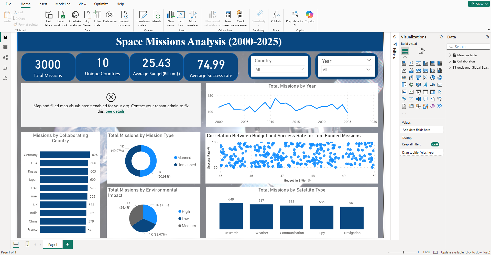

🚀 Space Missions Analysis Dashboard (2000–2025)

Interactive Power BI dashboard analyzing 3,000 global space missions across 10 countries over 25 years.

📊 Dashboard Preview

🔍 Key Insights
- Germany leads in mission collaboration (626 missions)
- Unmanned missions slightly outnumber manned (51% vs 49%)
- No strong correlation between budget and success rate
- Research satellites are the most common type (649)

🛠 Tools & Skills
Power BI · DAX · Data Modeling · Relationships · KPI Cards

📁 Files
- `Space_Missions.pbix` — Power BI report file
- `dataset.csv` — Raw data source
